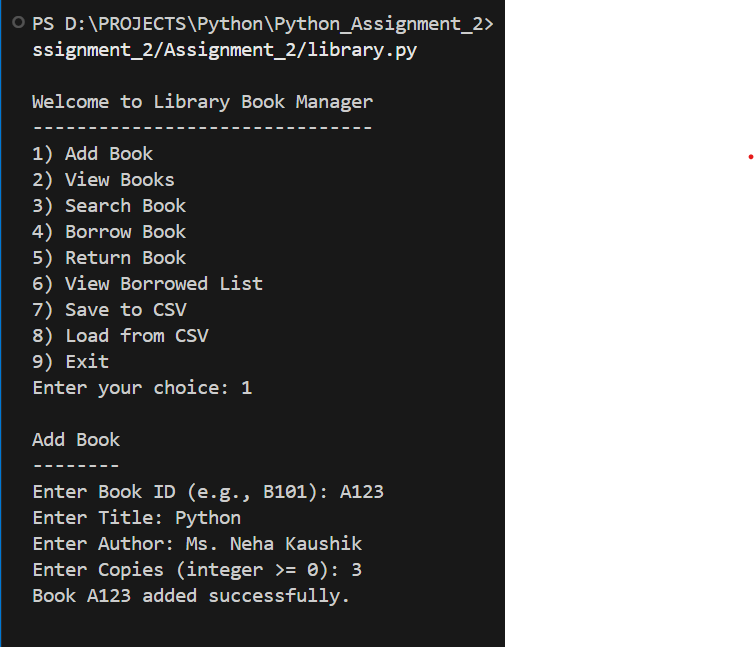
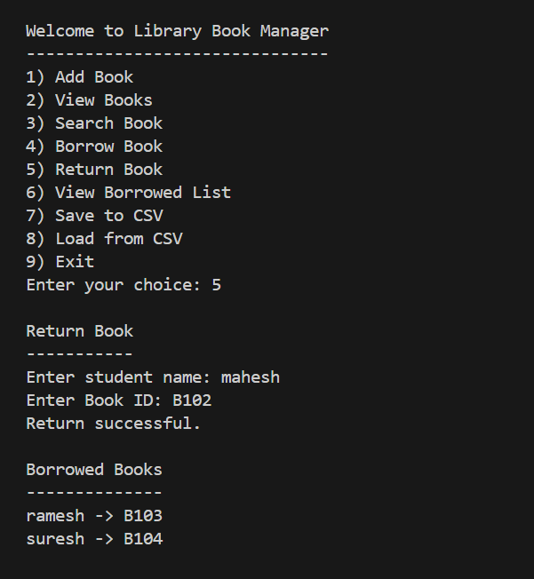
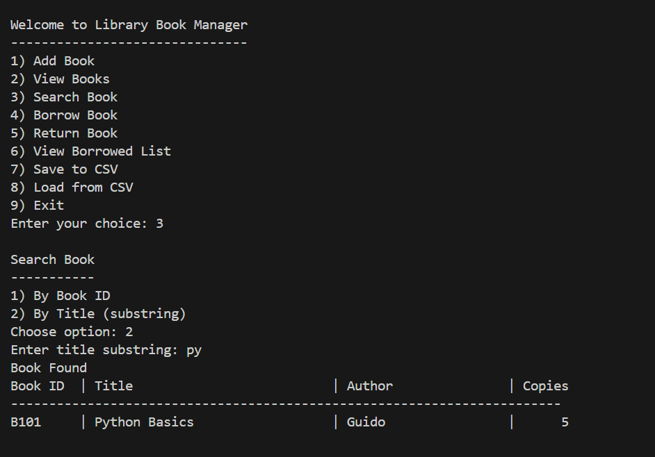
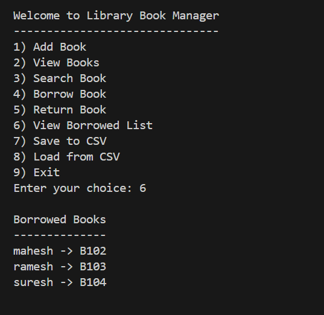
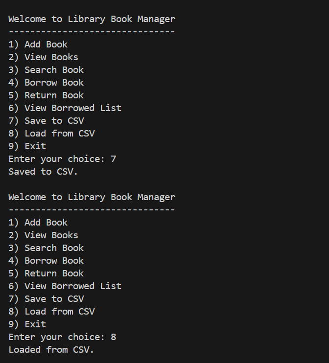
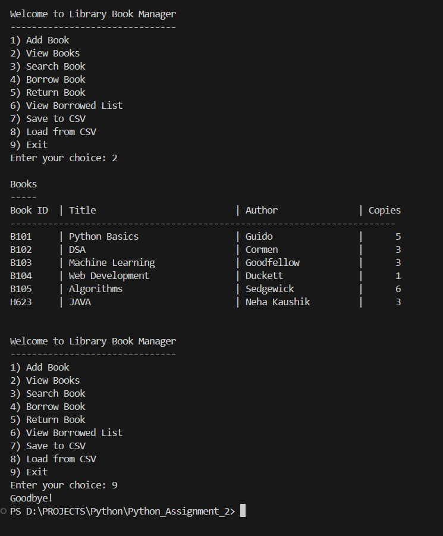
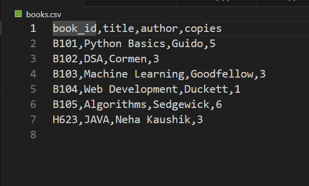
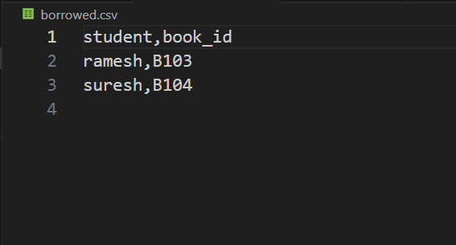

===========================================================
- Name: Gaurav Kumar
- Roll No: 2501660010
- Program: BCA (Cyber Security)
- Course Code: ETCCCPP103
- Course Name: Problem Solving with Python
- Faculty: Ms. Neha Kaushik
- Session: 2025-26 | Semester: I
- Assignment: Unit-2 Mini Project
- Title: Library Inventory & Borrowing System

===========================================================

# OUTPUT

1. Add Books

    

2. Borrow Book

    

3. Return Books

    

4. Search Books

    

5. View List of Borrowed Books

    

6. Save and Load data to/from csv file

    

7. View Book list

    

8. books.csv file

    

9. borrowed.csv file

    

# Library Book Manager (Python CLI)
A menu-driven CLI to manage library books, borrowing, and returns. Includes CSV persistence for books and borrowed records.

## Features
- Add, view, and search books (by ID or title substring).
- Borrow and return with stock updates.
- List borrowed items via list comprehension.
- CSV save/load for persistence (books.csv, borrowed.csv).

## Usage
1. Ensure Python 3.8+ is installed.
2. Run:
   python library.py
3. On first run, sample books are created if CSV files are missing. Use “Save to CSV” or exit to persist data.

## Files
- library.py: Main CLI program.
- books.csv: Saved on demand/exit with columns: ID, Title, Author, Copies.
- borrowed.csv: Saved on demand/exit with columns: Student, BookID.

## Notes
- One active borrow per student at a time for simplicity.
- If a borrow record references a missing book, returning will clean the record.

